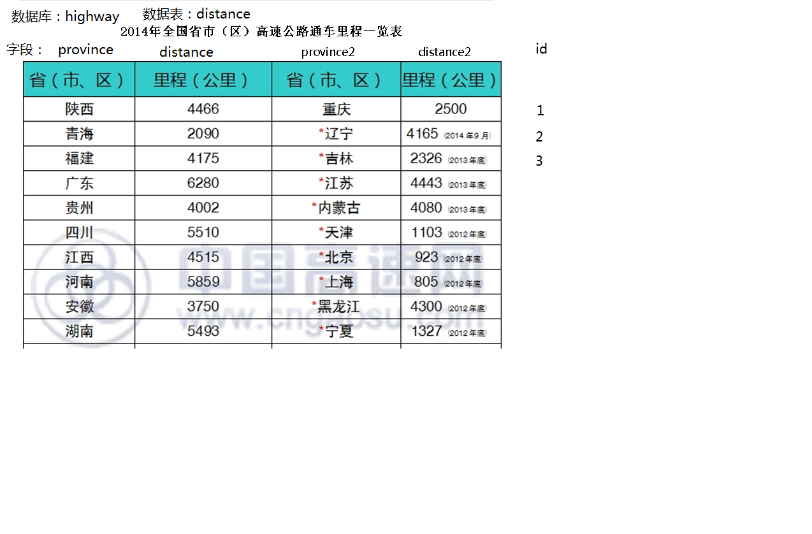

设计一个ASP.NET MVC网站，题目是：高速公路服务网站。

解决方案的名称是XCW037，项目名称是：PRJ037。

按给定数据表进行设计，图中给出数据库名称、数据表名称和字段名称。数据表名定义：distance037,不要用下图的distance。其他数据库内容跟下表一致。

要求与分数分布：

1. 运行正确，显示首页。首页内容自定义，包括：视图数据表和滚动新闻，计算并显示总里程数；每个人设计不能相同， 图片自选或自行绘制，视图相同的为0分（20分）
2. 运用jQuery组件（10分）
3. 运用LINQ TO SQL或者EF框架的增删查改功能（20分）
4. 结合MVC框架设计（20分）

1. 

   
